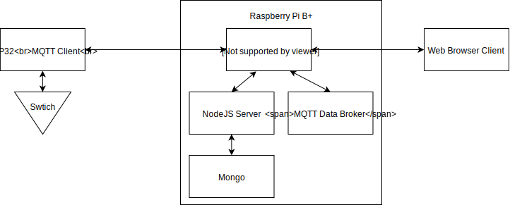

# Smart Bottle Opener
Simple IoT bottle opener project. Show the power of programming with simple
IoT. Made by [@jacobtheevans](https://github.com/jacobtheevans) and
[@BobbyLeChimp](https://github.com/BobbyLeChimp)

### Todo for project
- [x] Init Commit
- [x] Design document for the overall architecture of project
- [ ] Design document for the physical bottle opener device
- [ ] NodeJS master server for client management and storage
- [ ] MQTT Client for bottle opener
- [ ] Prototype bottle opener design
- [ ] Video demo

### Hardware
* [raspberry pi b +](https://www.raspberrypi.org/products/raspberry-pi-1-model-b-plus/)
* [esp-wroom-32](https://www.espressif.com/en/products/hardware/esp-wroom-32/overview)
* More Later

### Useful links
https://learn.cybus.io/lessons/mqtt-basics/
https://randomnerdtutorials.com/esp32-mqtt-publish-subscribe-arduino-ide/
https://github.com/espressif/arduino-esp32

### Architecture

